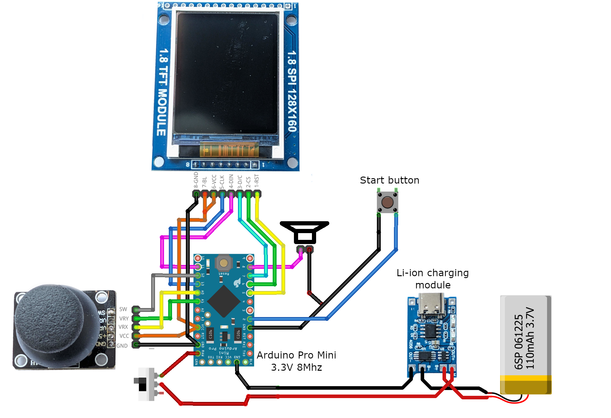

# Ardunoid

An unreasonably polished Arcanoid-like game for Arduino.

Written to fit the ATmega168-based Arduinos with 16kB of flash storage
and 1kB of RAM.

Wiring schema: 

Case for complete gadget can be printed using models in `casing-models`. 
Video about assembling all this: https://youtu.be/0YYeawrK3CQ (only in Ukrainian so far)
